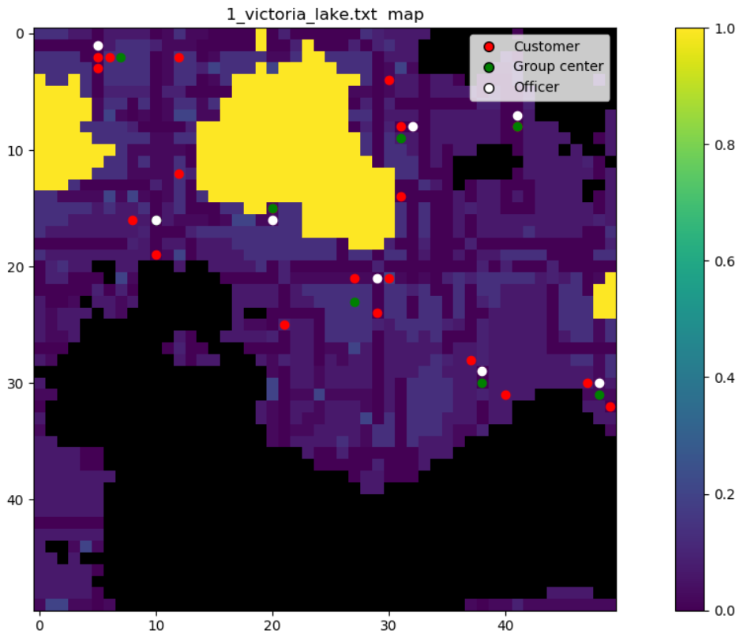
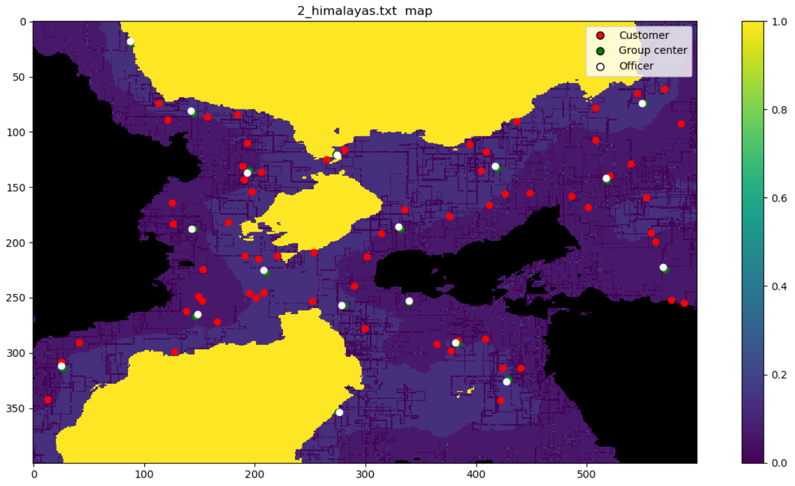

# Reply Code Challenge 2019

<p align="center">
	
</p>

## *Problem statement*
Given the map of the world, the terrain features, and the locations of Headquarters of our Customers, you need to build a number of Reply Offices that minimize the overall distance between the Offices and the Customer Headquarters. You can choose to place an office only on areas suitable for construction.
For each Reply Office you are going to build, you need to:
- provide its position on the map
- connect it with one or more Customer Headquarters

The world map is a grid composed by 'terrain cells' of different types. If a cell is non-walkable, you cannot build Offices in it and no path can cross it. Every other cell is walkable and suitable for construction. You cannot build Offices in the same cell of a Customer Headquarter. A path is a series of consecutive cells going from a Reply Office to a Customer Headquarter. From a cell you can only step UP, RIGHT, DOWN, LEFT to the next cell. No diagonal steps are allowed. Each step has a cost based on the type of the terrain of the next cell.
Each reached client generates a reward. The score for a client is computed as the reward of the client minus the cost to reach it. Your total score is computed as the sum of the scores for each connected client. Each Office built must have a path to at least a Customer. Given a pair (Office O, Customer C) it can’t exist more than one path from O to C.

## *Input format*
Input data will be provided in plain ASCII text file.
On the first line you will find four integers separated by a whitespace character:
- N: the width of the map
- M: the height of the map
- C: the number of Customer Headquarters
- R: representing the maximum number of Reply Offices that can be built

C lines follow, each one built of three integers describing the X coordinate, the Y coordinate, and the reward associated with Customer Headquarter.
Then, M lines follow, describing a row of N terrain cells. The top-left cell is the origin of the map and is thus assigned “(0, 0)” coordinates. In the world map columns are represented by the X coordinate, while rows by the Y coordinate.
## *Constraints*
1 ≤ 𝑅 < 𝐶 ≤ 500<br>
1 ≤ 𝑁 ≤ 2.000<br>
1 ≤ 𝑀 ≤ 2.000<br>

## *Output format*
For each path going from a Reply Office to a Customer Headquarter, output a single line built of the Reply Office X coordinate, Y coordinate, and a string representing the sequence of steps to reach the Customer Headquarter. Separate each of these three components by a single whitespace character. The Reply office coordinates are integer numbers. The sequence of steps is a string composed by the ASCII characters U, R, D, L (UP, RIGHT, DOWN, LEFT).


## *Our approach*
Aside the first test case "1_victoria_lake.txt", input maps keep increasing in size making it impossible to attempt brute forcing the solution using, for example, Dijkstra algorithm. To cope with this problem we initially subdivided the customer headquarters into clusters of neighbors, then starting from each centroid in the cluster we computed A* search around this point to find the minimum cost position to ne assigned to the office.

The following procedure will explain this approach a little more in details:

C: # of customer headquarters<br>
R: # of reply offices to build
```
1. Assign each customer headquarter to R cluster by using K-means algorithm;
2. Select the box area around the centroid of each cluster (sizes prespecified);
3. Create N cost maps, one for each customer in a cluster, by using A* algorithm in each position of the box (found in 2.) as initial state and a single customer in the cluster as goal state;
4. Sum the N maps together and find the position inside the sum matrix where the cost is minimum;
5. Assign office to the minimum cost position (found in 4.);
6. Repeat for each cluster until R office positions are obtained;
7. From each office position calculate the sequence of moves to reach every customer headquarter location by using A* search;
8. Print out solution (x coordinate, y coordinate, sequence of moves);
```
## *Scores*
> **1_victoria_lake:** 4.702 points<br>
> **2_himalayas:** 3.651.108 points<br>
> **3_budapest:** 3.325.504 points<br>
> **4_manhattan:** 770.110 points<br>
> **5_oceania:** 2.945.099 points<br>

>**Total score:** 10.696.523 points 

## *Screenshots*
<p align="center">
	
</p>
<p align="center">
	
</p>


